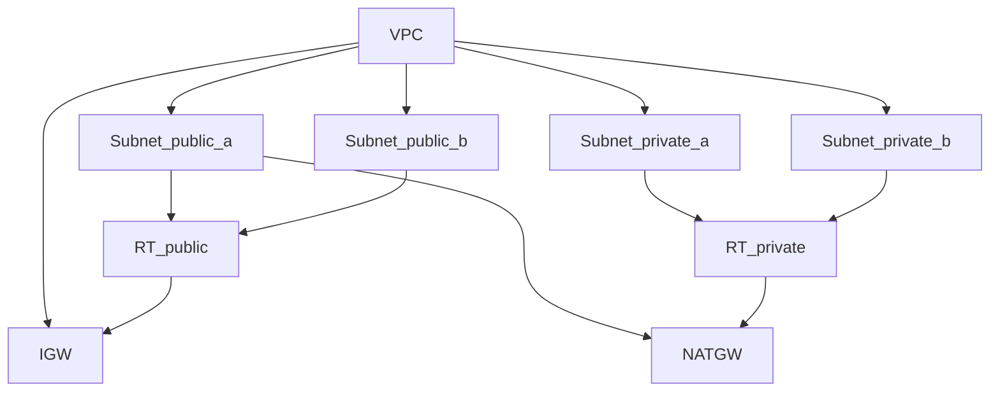

# Network Module ドキュメント（VPC / 2AZ / NAT1 台）

## 目的と読者

- 読者: 学習者・本リポジトリの開発者
- 目的: 最小の VPC ネットワーク構成の意図と使い方を共有する

## 全体像（要約）

- 2AZ 構成の VPC に Public / Private サブネットを 1 つずつ作成
- NAT Gateway は 1 台を Public サブネットに配置し、Private からの送信のみインターネットアクセスを提供
- Public は IGW へ、Private は NAT へ既定経路をルーティング

## ネットワーク構成図（概念）

注記: Mermaid の制約に従い、図中では括弧や小数点を使用していません。既定経路は default_route の意で RT_public と RT_private にて表現しています。

## 何が何のためにあるか（主要コンポーネント）

- VPC: 10 0 0 0 16 などのプライベート CIDR 空間を持つ仮想ネットワーク
- IGW: インターネットゲートウェイ。Public 向けの外部出口
- Subnet*public*\*: Public サブネット。起動時に Public IP を付与
- Subnet*private*\*: Private サブネット。外部から直接は入らず、NAT 経由で送信のみ
- NATGW: NAT ゲートウェイ。Private から外部へのアウトバウンドを仲介
- RT_public: Public 用ルートテーブル。既定経路を IGW に設定
- RT_private: Private 用ルートテーブル。既定経路を NATGW に設定

## 依存関係（解決順のイメージ）

1. VPC
2. IGW と Subnet 群
3. NAT 用 EIP と NATGW（Public サブネット上）
4. RT_public と RT_private
5. 各 Subnet の RT への関連付け

## 変数（入力）

- environment: 環境名（例: prod）
- project: プロジェクト名（例: todo-gin）
- tags: 追加タグ（Environment と Project は内部で自動付与）
- vpc_cidr: VPC の CIDR（既定: 10 0 0 0 16）
- az_names: 利用 AZ 名のリスト（未指定なら先頭 2 つを自動選択）
- public_subnet_cidrs: Public CIDR 配列（既定: 10 0 0 0 24, 10 0 1 0 24）
- private_subnet_cidrs: Private CIDR 配列（既定: 10 0 10 0 24, 10 0 11 0 24）

CIDR の決め方（学習向けの理由）

- 10 系は広い範囲を柔軟に分割しやすく、家庭内 LAN などと衝突しにくい
- VPC は 16 程度にして余白を確保、サブネットは 24 で扱いやすく

## 出力（outputs）

- vpc_id: 作成した VPC の ID
- public_subnet_ids: Public サブネット ID 一覧
- private_subnet_ids: Private サブネット ID 一覧
- nat_gateway_id: NATGW の ID

## 使い方（環境側）

- 呼び出し例は `terraform/enviroments/prod` を参照
- 実行手順
  1. cd terraform/enviroments/prod
  2. terraform init
  3. terraform plan
  4. terraform apply

## コストとトレードオフ

- NATGW は時間課金と処理料が発生（最も大きな固定費になりやすい）
  - 学習/開発では NAT 1 台がコストとシンプルさのバランス良
  - 高可用が必要になれば AZ ごとに NAT を追加
- VPC Endpoint で NAT 利用を抑制する選択肢もあるが、設計の複雑度が上がる

## よくある拡張

- NAT を AZ ごとに 1 台化
- Subnet の追加分割、拠点網との接続、VPC Endpoint の導入
- 監査用や共有サービス用の専用 Subnet の分離

## 変更履歴

- 2025-09-21: 初版作成
